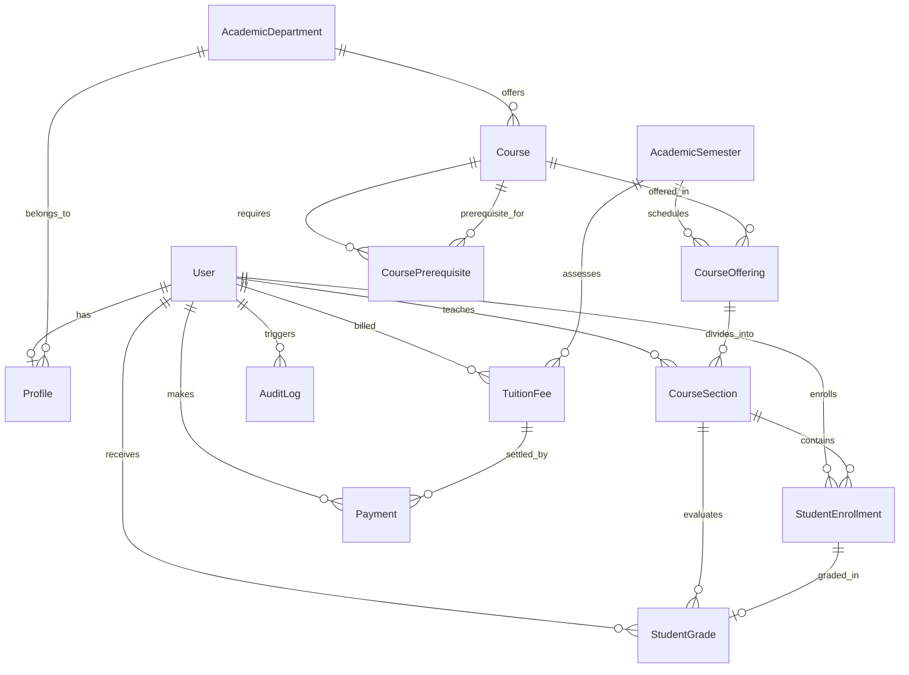
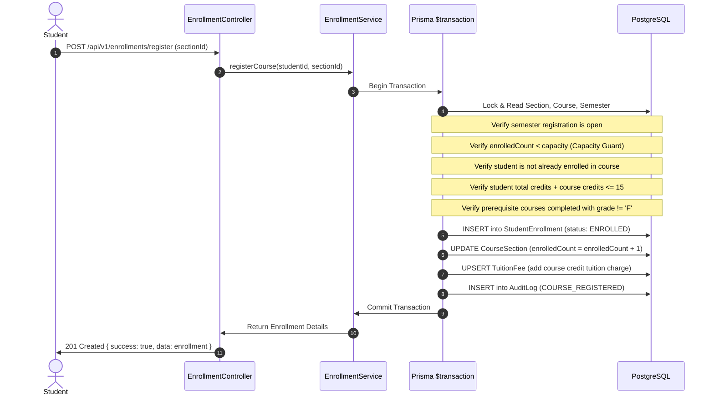
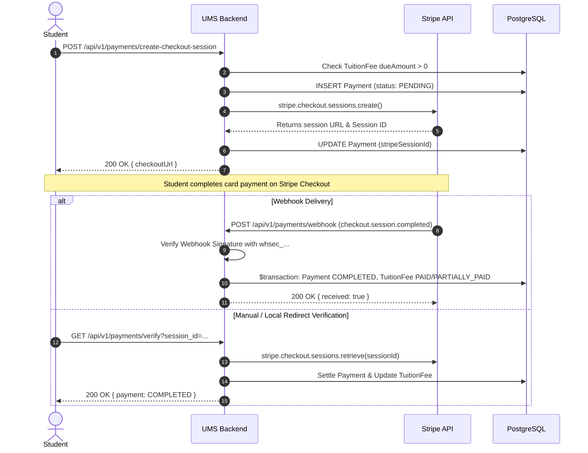

# 🏛️ University Management System (UMS) - Architecture & Technical Design

This document details the system design, entity-relationship models, transaction boundaries, state transitions, and security topology of the **University Management System (UMS)**.

---

## 1. 🏗️ High-Level System Architecture

```mermaid
graph TD
    Client["Client / Postman / Frontend"]
    
    subgraph Security Layer
        Helmet["Helmet (HTTP Headers)"]
        CORS["CORS Policy"]
        RateLimit["Rate Limiter (200 req / 15 min)"]
    end
    
    subgraph Application Core
        Router["Centralized API Router (/api/v1)"]
        AuthGuard["JWT / RBAC Middleware"]
        Validator["Zod Schema Validation"]
        Controllers["Domain Controllers"]
        Services["Business Logic Services"]
        PrismaORM["Prisma Client & Driver Adapter"]
    end
    
    subgraph External & Persistence
        NeonPostgres[("Neon PostgreSQL Database")]
        StripeGateway["Stripe Payment Gateway"]
        GCPAuth["Google OAuth (GCP)"]
        AuditEngine[("Audit Logging Engine")]
    end
    
    Client --> SecurityLayer
    Security Layer --> Router
    Router --> AuthGuard
    AuthGuard --> Validator
    Validator --> Controllers
    Controllers --> Services
    Services --> PrismaORM
    Services --> StripeGateway
    Services --> GCPAuth
    Services --> AuditEngine
    PrismaORM --> NeonPostgres
```

---

## 2. 🗄️ Entity Relationship Diagram (ERD)



---

## 3. ⚡ Concurrency & ACID Transaction Boundary (Course Registration)

To prevent race conditions, overselling seats beyond section capacity, and violating academic prerequisites:



---

## 4. 💳 Stripe Payment Lifecycle



---

## 5. 🛡️ Role-Based Access Control (RBAC) Matrix

| Endpoint Group | Resource | ADMIN | FACULTY | STUDENT | Unauthenticated |
|---|---|:---:|:---:|:---:|:---:|
| `/auth/register` | Student Registration | ✅ | ✅ | ✅ | ✅ |
| `/auth/login` | Authentication | ✅ | ✅ | ✅ | ✅ |
| `/users/me` | Own Profile | ✅ | ✅ | ✅ | ❌ |
| `/users` | User Directory | ✅ | ❌ | ❌ | ❌ |
| `/departments` (Create/Edit) | Academic Departments | ✅ | ❌ | ❌ | ❌ |
| `/courses` (Create/Edit) | Courses & Prerequisites | ✅ | ❌ | ❌ | ❌ |
| `/course-offerings` | Section Management | ✅ | ❌ | ❌ | ❌ |
| `/enrollments/register` | Course Enrollment | ❌ | ❌ | ✅ | ❌ |
| `/enrollments/section/:id` | Section Student Roster | ✅ | ✅ | ❌ | ❌ |
| `/grades/submit` | Marks Submission | ✅ | ✅ (Own Section) | ❌ | ❌ |
| `/grades/my-transcript` | Academic Transcript | ❌ | ❌ | ✅ | ❌ |
| `/payments/create-checkout-session` | Stripe Payment | ❌ | ❌ | ✅ | ❌ |
| `/admin/dashboard-stats` | University Metrics | ✅ | ❌ | ❌ | ❌ |
| `/audit-logs` | Security Audit Trail | ✅ | ❌ | ❌ | ❌ |
